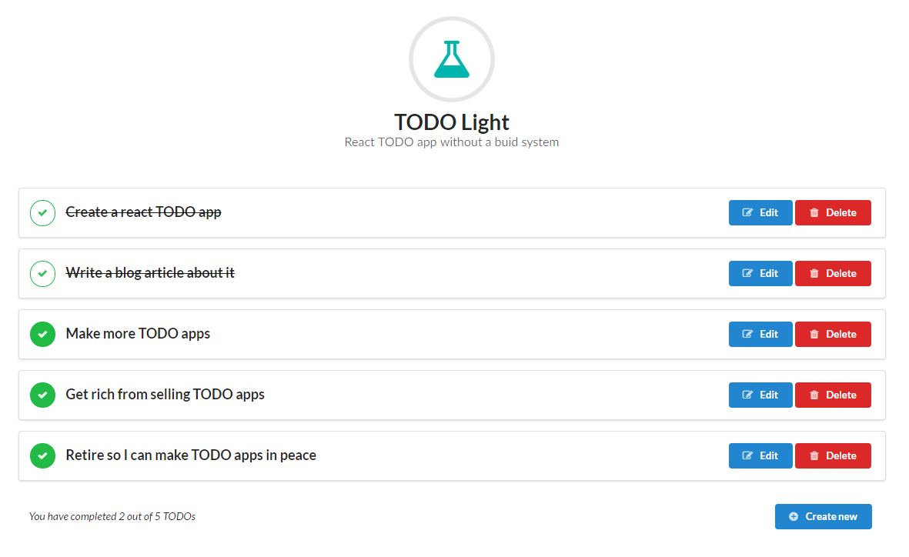

# TODO Light

#### An experimental React TODO app *with* JSX and *without* a build system.

See it in action here: https://panta82.github.io/todo_light/

### Instructions

Clone. Edit files. Open `index.html` in browser. There is no build system or anything.

Unfortunately, babel will need to load script files throgh AJAX, so you'll need a web server. `file://` protocol will not work.